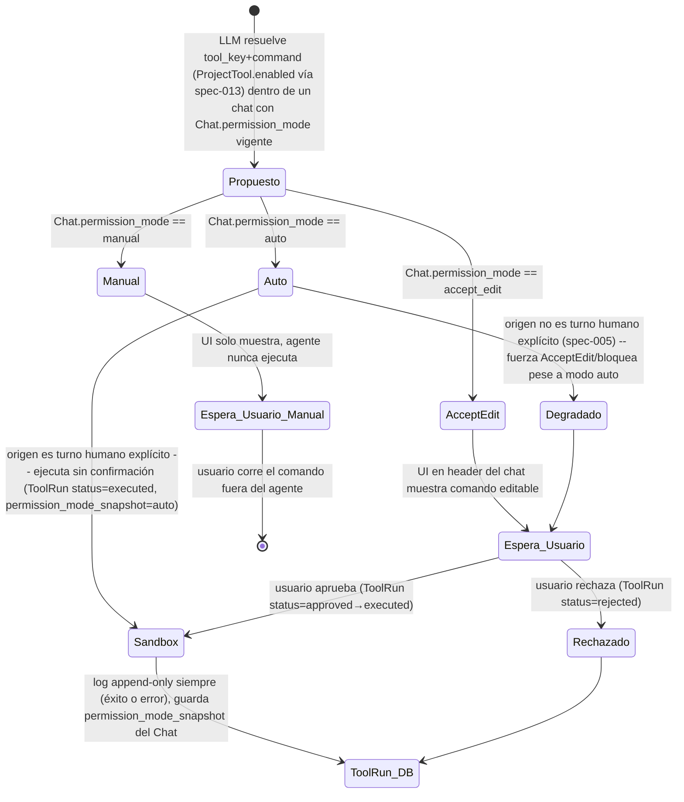

# Spec: Ejecución de Comandos con Permission Modes de Chat y ToolRun (spec-015)

## Summary

La ejecución real de `ToolCatalogEntry.actions[].command` reabre, deliberadamente, una superficie de RCE que el diseño original excluyó a propósito (ver docstring de `app/models/tool_catalog_entry.py`). Esta spec define tres permission modes configurables a nivel de **chat** (no de tool individual) — `auto`, `accept_edit`, `manual` — que actúan como gates de **confirmación humana previa a la ejecución**, combinados con un sandbox aislado, una allowlist de comandos y una tabla `ToolRun` append-only que registra cada propuesta de ejecución. El riesgo de RCE se reduce no mediante confiar en tools "seguras" sino forzando que **todo** comando real —sin excepción— pase por el mismo sandbox aislado con la misma allowlist y los mismos límites de recursos, independientemente del modo elegido. Los tres permission modes difieren únicamente en si existe una confirmación humana previa a la transición `proposed → executed`, nunca en cómo está aislada la ejecución.

## Permission Modes Diagram

**Regla no-negociable**: una propuesta de comando cuyo único origen sea contenido de rol `tool`/documento nunca resuelve a ejecución automática, aunque `Chat.permission_mode == auto` — defensa en profundidad sobre spec-005.

## Acceptance Criteria

### Sandboxing y Autorización (security-compliance)

**1. Allowlist de comandos — sin shell libre**

- [ ] Ningún comando real se invoca mediante shell con interpolación de texto libre (`shell=True`, f-strings/concatenación armando una línea de comando, `os.system`, `subprocess.run(cmd_string, shell=True)`). Toda invocación usa `subprocess` con `argv` como lista (`shell=False`), nunca una cadena.
- [ ] Existe una allowlist explícita, versionada en el repo (análoga a `.ai/guardrails/restricted-ops.json`, no editable desde la UI de catálogo de tools), que mapea `(tool_key, action_id)` → un `argv` fijo (ejecutable con ruta absoluta o resuelta contra un `PATH` restringido + argumentos tipados). El campo `ToolCatalogEntry.actions[].command` es solo metadata descriptiva para humanos — **nunca** se ejecuta el valor de ese campo directamente ni se usa para construir el `argv` real.
- [ ] Si `(tool_key, action_id)` no tiene entrada en la allowlist, la propuesta de ejecución nunca alcanza `status=executed` bajo ningún `permission_mode` — el `ToolRun` queda en `status=failed` con error estructurado (`code="no_allowlist_entry"`), incluso si un humano aprobó la propuesta en `accept_edit`.
- [ ] Los parámetros variables de un comando (si el `argv` de la allowlist los admite) se validan contra un schema estricto por parámetro (enum, regex, tipo) antes de insertarse en una posición fija del `argv` — nunca se sustituye texto libre no validado directamente en la línea de comando.
- [ ] Existe un test que prueba que un `command` fuera de la allowlist (o con un parámetro que no matchea su schema) nunca ejecuta, para los tres `permission_mode`.

**2. Ejecución aislada — sin credenciales, sin red por defecto**

- [ ] El proceso ejecutado recibe un entorno (`env`) construido explícitamente desde una allowlist de variables (potencialmente vacía por defecto) — nunca hereda `os.environ` del proceso backend. En particular, `GROQ_API_KEY`, `AUDIT_DATABASE_URL`, cualquier secreto/JWT/API key del backend, y cualquier variable no listada explícitamente, **no** son visibles al proceso ejecutado.
- [ ] El proceso ejecutado corre con acceso de filesystem restringido a un directorio efímero dedicado por `ToolRun` (creado antes de ejecutar, purgado después), sin acceso de escritura al código fuente, a la base de datos, ni al índice de Chroma.
- [ ] Sin acceso de red saliente por defecto (deny-all). Una tool que necesite red requiere una allowlist explícita de hosts/puertos de destino por `(tool_key, action_id)`, declarada junto a la entrada de la allowlist del punto 1, y queda registrada en el `ToolRun` qué destino se permitió.
- [ ] Existe un test que verifica que el subproceso ejecutado no puede leer `GROQ_API_KEY`/`AUDIT_DATABASE_URL` del entorno (ni por variable de entorno ni por archivo montado) y que una request de red saliente no allowlisteada falla/se bloquea.

**3. Límites de recursos — timeout, CPU/memoria, y fallo estructurado**

- [ ] Todo comando ejecutado tiene un timeout duro configurado (default conservador, ej. 30s), aplicado por el propio mecanismo de sandbox (no confiado al binario ejecutado). Al vencer, el proceso se mata (`SIGKILL`/equivalente) — no queda un proceso huérfano.
- [ ] Todo comando ejecutado tiene un límite de CPU y de memoria aplicado a nivel de proceso/contenedor (no opcional, no delegado al binario ejecutado).
- [ ] Exceder timeout, CPU o memoria produce `ToolRun.status=failed` con un error estructurado (`{"code": "timeout"|"resource_limit_exceeded", "detail": str}`) — nunca una excepción cruda propagada al loop del agente ni al usuario (mismo criterio que spec-003 para tools regulares).
- [ ] Un exit code no-cero del comando también resuelve a `ToolRun.status=failed` con `{"code": "nonzero_exit", "exit_code": int, "stderr": str (truncado/sanitizado)}` — nunca se re-lanza como excepción no capturada.
- [ ] Existe un test que fuerza un timeout y un test que fuerza un exit code no-cero, verificando en ambos casos el shape estructurado del error y que el proceso no queda corriendo tras el fallo.

**4. El sandbox aplica sin excepción — ninguna metadata exime**

- [ ] El sandbox (allowlist + aislamiento + límites de recursos, puntos 1-3) se aplica a **toda** tool cuyo `ToolCatalogEntry.actions[].command` se resuelva a ejecución real, sin excepción. Ningún campo declarativo/informativo del catálogo (`label`, `description`, o cualquier otro campo metadata que el usuario pueda setear vía `POST/PATCH /api/tools`) exime a una tool de pasar por sandboxing/`ToolRun`.
- [ ] No existe, en ningún punto del código (backend ni frontend), una rama que resuelva "tool de bajo riesgo" a partir de metadata del catálogo para saltear el sandbox o el registro `ToolRun`. Esta categoría no existe en el diseño.
- [ ] Existe un test que crea una `ToolCatalogEntry` con metadata que sugiere "bajo riesgo" (ej. `label="Solo lectura"`) y verifica que igual pasa por el sandbox completo y genera `ToolRun`.

**5. `permission_mode=auto` — solo por acción humana explícita**

- [ ] `Chat.permission_mode` tiene default `manual` en la creación de todo `Chat` (con o sin `case_id`). Ningún flujo del backend crea un `Chat` con `permission_mode=auto` por defecto.
- [ ] La única forma de que `Chat.permission_mode` valga `auto` es un `PATCH` explícito sobre ese `Chat`, disparado por una acción humana en la UI (selector en el header/sidebar del chat). El LLM no tiene ninguna tool ni mecanismo para modificar `Chat.permission_mode` de su propia conversación.
- [ ] Existe un test que verifica que no hay ningún endpoint/tool invocable por el LLM que permita mutar `Chat.permission_mode`, y un test que verifica el default `manual` en la creación de `Chat`.

**6. Por qué este diseño no reabre el RCE que el docstring documenta como fuera de alcance**

- [ ] El diseño documenta explícitamente que los tres `permission_mode` comparten **exactamente** el mismo sandbox — misma allowlist (punto 1), mismo aislamiento de credenciales/red (punto 2), mismos límites de recursos (punto 3) —, y difieren únicamente en si existe una confirmación humana previa a la transición `proposed → executed`:
  - `manual`: el backend nunca ejecuta; solo muestra el comando propuesto.
  - `accept_edit`: el backend ejecuta solo tras `PATCH` humano de aprobación explícita sobre ese `ToolRun` puntual.
  - `auto`: el backend ejecuta sin aprobación por-`ToolRun`, pero solo dentro del mismo sandbox, y solo si (a) un humano seteó `Chat.permission_mode=auto` explícitamente (punto 5) y (b) el origen de la propuesta es un turno humano explícito, nunca contenido de rol `tool`/documento (regla no-negociable de `agentic-core`).
- [ ] Ninguna combinación de `permission_mode` permite ejecutar un comando fuera de la allowlist, con las credenciales del backend visibles, sin límites de recursos, o desde una tool sin `ToolRun` — el riesgo que el docstring de `ToolCatalogEntry` marcó como "requiere su propio diseño" queda acotado precisamente por los puntos 1-4.

### Persistencia: ToolRun y Chat.permission_mode (backend-api)

**Bloque 1 — Esquema de `ToolRun` (tabla nueva, append-only)**

- [ ] `ToolRun` se modela en `app/models/tool_run.py`, mismo patrón que `Finding`/`Report`: `id` (`String(36)`, `default=_new_uuid`), `created_at`/`updated_at` (`DateTime(timezone=True)`, `onupdate=_utcnow` en `updated_at`).
- [ ] `chat_id: str` es `ForeignKey("chats.id")`, `nullable=False`, indexado. Es válido tanto si `Chat.case_id` es `NULL` (chat standalone) como si tiene valor — `ToolRun` nunca depende de `case_id` directamente, siempre navega a través de `Chat`.
- [ ] `tool_key: str` (`ForeignKey("tool_catalog_entries.key")`, `nullable=False`) y `action_id: str` (`String`, `nullable=False`) identifican qué acción del catálogo se propuso.
- [ ] `command_resuelto: str` (`nullable=False`) persiste el `argv` real ya resuelto por la allowlist de security-compliance — nunca el texto descriptivo de `ToolCatalogEntry.actions[].command`, que sigue siendo metadata para humanos. Este campo es lo que efectivamente corre (o se propone correr) en el sandbox.
- [ ] `permission_mode_snapshot: str` (`String(16)`, `nullable=False`) congela el valor de `Chat.permission_mode` vigente al momento del `INSERT` (`status=proposed`). No se recalcula ni se sobrescribe si el usuario cambia `Chat.permission_mode` después — es un snapshot histórico, no una referencia viva.
- [ ] `status: str` (`String(16)`, `nullable=False`, `default="proposed"`) es una taxonomía cerrada validada como `Literal` en `app/schemas/tool_run.py`: `proposed | approved | rejected | executed | failed`. Transiciones válidas: `proposed → approved → executed`, `proposed → approved → failed`, `proposed → rejected`, y (solo si `permission_mode_snapshot == "auto"` y origen humano verificado) `proposed → executed` o `proposed → failed` directo.
- [ ] `triggered_by: str` (`String(16)`, `nullable=False`) usa el mismo criterio semántico que `Finding.triggered_by` del resto del proyecto: `human` si la aprobación/rechazo la ejecutó un usuario real vía `PATCH`, `llm` si la propuesta inicial la generó el loop agéntico. Fijado siempre server-side.
- [ ] `resolved_by: str | None` (`String(255)`, `nullable=True`) es el identificador del usuario que aprobó o rechazó el `ToolRun` vía `PATCH` — poblado solo cuando existe `triggered_by="human"` y la transición es `proposed → approved`/`rejected`. Nunca se puebla server-side sin una acción `PATCH` explícita.
- [ ] `error_code: str | None` (`String(32)`, `nullable=True`) y `error_detail: str | None` (`String`, `nullable=True`) son mutuamente `NULL` salvo cuando `status="failed"`. `error_code` reusa exactamente el set cerrado: `no_allowlist_entry | timeout | resource_limit_exceeded | nonzero_exit`.
- [ ] `exit_code: int | None` (`Integer`, `nullable=True`) solo se puebla cuando `error_code="nonzero_exit"` o cuando `status="executed"` con exit code `0` disponible.
- [ ] No existe ningún `db.delete(...)` sobre `ToolRun` en el codebase (routers, tools, scripts). El único mecanismo de "corrección" tras un estado terminal es un nuevo `ToolRun` (nueva propuesta).
- [ ] `ToolRun` se agrega a `.ai/guardrails/restricted-ops.json` en el mismo patrón append-only que ya cubre `audit_trail`/`audit_findings`/`findings`/`reports` (bloqueo duro de `DELETE FROM tool_runs`).

**Endpoints de API para ToolRun**

- [ ] `PATCH /api/tool-runs/{id}` con body `{status: "approved"|"rejected", command_resuelto?: string}` — permite transicionar un `ToolRun` de `status=proposed` a `approved`/`rejected`, y opcionalmente sobrescribir el `command_resuelto` editable (si el sandbox admite parámetros variables). Solo callable por usuarios humanos, nunca por el LLM.
- [ ] `GET /api/chats/{chat_id}/tool-runs?status=proposed` retorna un array de `ToolRun` del chat, con filtro opcional por status. Permite a la UI descubrir propuestas pendientes de aprobación para un chat.
- [ ] Ambos endpoints son responsables explícitamente de setear `resolved_by` (del llamador) y `triggered_by="human"` en `PATCH`.

**Bloque 2 — `Chat.permission_mode`**

- [ ] `app/models/chat.py` agrega `permission_mode: Mapped[str] = mapped_column(String(16), nullable=False, default="manual", server_default="manual")`.
- [ ] Se agrega una migración puntual `_migrate_add_permission_mode_if_missing()` en `app/main.py`, mismo patrón exacto que `_migrate_add_archived_if_missing`: chequea `inspector.has_table("chats")`, chequea la columna, y si falta corre `ALTER TABLE chats ADD COLUMN permission_mode VARCHAR(16) NOT NULL DEFAULT 'manual'`.
- [ ] `permission_mode` es una taxonomía cerrada validada como `Literal["auto", "accept_edit", "manual"]` en `app/schemas/chat.py`, reusado por `ChatOut` y `ChatPatch`.
- [ ] `ChatOut` expone `permission_mode: PermissionMode`.
- [ ] `ChatPatch` agrega `permission_mode: PermissionMode | None = None` como campo opcional mutable — se reusa `PATCH /api/chats/{id}` existente.
- [ ] El valor de `permission_mode` es válido y funciona igual (sin condicionales sobre `case_id`) tanto para chats standalone (`case_id=None`) como para chats de proyecto.
- [ ] Ningún endpoint/tool invocable por el LLM puede mutar `Chat.permission_mode`. La única vía de escritura es `PATCH /api/chats/{id}` invocado por un caller humano.
- [ ] `ChatPatch` sigue con `model_config = ConfigDict(extra="forbid")`: un payload con un campo desconocido sigue rechazándose con 422.
- [ ] Un `PATCH` con `permission_mode` fuera del enum cerrado responde 422 con el contrato de error uniforme de spec-010.

**Bloque 3 — Destino de `ProjectTool.confirm: bool`**

- [ ] Se remueve `confirm: Mapped[bool]` de `app/models/project_tool.py`.
- [ ] Se remueve `confirm` de `ProjectToolPatch`/`ProjectToolOut` en `app/schemas/project_tool.py`.
- [ ] Se remueve el bloque correspondiente de `app/routers/project_tools.py`.
- [ ] Se agrega `_migrate_drop_project_tool_confirm_if_present()` en `app/main.py`: valida `DATABASE_URL.startswith("sqlite")` y `sqlite3.sqlite_version_info >= (3, 35, 0)` antes de `DROP COLUMN`; fallback seguro (columna huérfana no leída/escrita) si no soporta.
- [ ] Un payload con `confirm` responde 422 vía `extra="forbid"`, no se ignora silenciosamente.
- [ ] La spec nueva documenta que `confirm` fue reemplazado funcionalmente por `Chat.permission_mode` + `ToolRun`.

### Loop Agéntico (agentic-core)

**Resolución de permission_mode en el loop**

- [ ] El loop resuelve `Chat.permission_mode` leyendo la fila `Chat` del `chat_id` del turno **actual**, nunca una config por `tool_key`/`ToolCatalogEntry`.
- [ ] `run_agent_turn` recibe `chat_id: str` como parámetro explícito del caller — nunca aceptado dentro de `tool_input`.
- [ ] `permission_mode_snapshot` de cada `ToolRun` se lee de `Chat.permission_mode` en el momento de crear ese `ToolRun` puntual (no cacheado).
- [ ] La rama de `permission_mode` solo aplica a `tool_call`s que resuelven a una tool con `command` real. Las tools fijas sin `command` real (`search_evidence`, `create_finding`, `generate_report`) siguen ejecutándose directo vía `TOOL_DISPATCH`.
- [ ] **`manual`**: el loop nunca ejecuta. Crea `ToolRun(status=proposed)` vía el endpoint de propuesta y corta el turno.
- [ ] **`accept_edit`**: crea `ToolRun(status=proposed)` y pausa el turno — el turno termina devolviendo el `ToolRun` pendiente.
- [ ] **`auto` con origen humano verificado**: el loop invoca directo el endpoint de ejecución sin espera por-`ToolRun` — transiciona `proposed → executed`/`failed` directo.
- [ ] **`auto` con origen NO verificado**: degrada a `accept_edit` — crea `ToolRun(status=proposed)` y pausa el turno, sin excepción.
- [ ] **Criterio testeable de "origen humano explícito"**: un `tool_call` de ejecución tiene origen humano si fue emitido por el LLM en iteración 0 de `run_agent_turn` (ningún mensaje `role="tool"` anexado todavía en esta invocación). Mensajes `tool` anexados *durante* el turno actual se detectan vía flag `has_tool_result_this_turn: bool`.
- [ ] La verificación de origen humano es la **única** señal que decide la degradación — no se acepta ningún campo del `tool_input` del LLM como sustituto.
- [ ] `ToolRun.triggered_by` se fija server-side a partir del flag (`human` si origen verificado, `llm` si no) — nunca aceptado como valor propuesto por el LLM.
- [ ] Un `ToolRun` en `status=failed` nunca se reintenta automáticamente. El resultado vuelve al LLM como mensaje `role="tool"` con shape de error estructurado (spec-003). Un reintento es un **nuevo** `tool_call`/`ToolRun`.
- [ ] La documentación de tools con `command` real se pasa únicamente vía `tools=` de la API, nunca interpolada en `SYSTEM_PROMPT` (regla 4, `agentic-tool-use`).
- [ ] El resultado de ejecución que vuelve al LLM se envuelve con `<untrusted_context>` — no se asume "confiable" solo por haber pasado por el sandbox.
- [ ] Cambiar `Chat.permission_mode` es exclusivamente humano vía `PATCH /api/chats/{id}` — el loop lo trata como estrictamente solo-lectura.
- [ ] `MAX_TOOL_ITERATIONS` no se modifica: pausar el turno por aprobación humana termina `run_agent_turn`.

### UI (chainlit-ui)

**Selector de Chat.permission_mode**

- [ ] Existe un único selector de `permission_mode` por chat (no un control por tool), con tres opciones: `Auto`, `Aceptar y editar` (`accept_edit`), `Manual` — `Manual` preseleccionado por default.
- [ ] El selector aparece tanto en chats con `case_id` como standalone.
- [ ] Cambiar el selector dispara `PATCH /api/chats/{id}` con `{ permission_mode }`, refleja el valor devuelto (revertir si falla).
- [ ] En un chat todavía no creado, el selector muestra `Manual` por default; la elección se aplica tras `createChat`.
- [ ] Cambiar `permission_mode` a mitad de conversación no re-renderiza ni reevalúa tarjetas de `ToolRun` ya propuestos bajo el modo anterior.
- [ ] El estado "degradado" (auto configurado pero esta propuesta puntual pide aprobación) se comunica **en la tarjeta del `ToolRun`**, nunca cambiando el valor mostrado por el selector global.

**Flujo de aprobación de ToolRun**

- [ ] Un `ToolRun` nunca se muestra con el texto crudo de `ToolCatalogEntry.actions[].command`; solo `command_resuelto`.
- [ ] `manual`: muestra `tool_key` + `command_resuelto` en bloque de código, sin botón de ejecutar.
- [ ] `accept_edit` (incluyendo degradado): `command_resuelto` editable o lectura según parámetros variables; botones "Aprobar"/"Rechazar".
- [ ] Caso degradado: badge/aviso explícito distinguible del `accept_edit` "normal" (copy: "Modo Auto, pero esta propuesta puntual requiere tu aprobación").
- [ ] Estados terminales: `executed` (badge éxito + salida), `failed` (badge error + `error_code`/`error_detail`/`exit_code`), `rejected`.
- [ ] Ninguna superficie permite aprobar/rechazar por texto libre — siempre acción tipada.

**React específico**

- [ ] Nuevo `PermissionModeSelector.tsx` en header de `ChatRoute.tsx`.
- [ ] `ChatSummary` gana `permissionMode`.
- [ ] Nueva `updateChatPermissionMode(chatId, mode)` en `backend.ts`.
- [ ] Nuevo `ToolRunCard.tsx` para renderizar tarjetas de propuestas.
- [ ] Tipo `ToolRun` en `domain.ts`.
- [ ] `getToolRuns(chatId)`/`resolveToolRun(id, {...})` en `backend.ts`.

**Chainlit específico (legacy)**

- [ ] Usa `cl.ChatSettings` con widget `Select` para el modo de ejecución.
- [ ] `@cl.on_settings_update` persiste contra el `Chat` de la sesión.
- [ ] Reusa patrón `cl.Action` de spec-006 para aprobación.
- [ ] Acciones para `accept_edit`: `approve_tool_run`, `edit_and_approve_tool_run` vía `cl.AskUserMessage`, `reject_tool_run`.
- [ ] `manual`: bloque de código fenced sin Action.

## Test Cases

### Sandboxing y Autorización (security-compliance)

- `test_command_execution_never_uses_shell_true_or_string_interpolation`
- `test_command_outside_allowlist_never_reaches_executed_status`
- `test_command_parameter_failing_schema_validation_is_rejected`
- `test_executed_subprocess_cannot_read_groq_api_key_or_database_url`
- `test_executed_subprocess_has_no_default_network_egress`
- `test_command_exceeding_timeout_is_killed_and_marked_failed_structured`
- `test_command_exceeding_resource_limits_is_marked_failed_structured`
- `test_nonzero_exit_code_never_propagates_as_raw_exception`
- `test_sandbox_applies_regardless_of_catalog_metadata_labeled_low_risk`
- `test_no_llm_invocable_path_mutates_chat_permission_mode`
- `test_chat_created_with_permission_mode_manual_by_default`
- `test_auto_mode_still_enforces_same_allowlist_and_resource_limits_as_manual`

### Persistencia: ToolRun y Chat.permission_mode (backend-api)

- `test_tool_run_requires_chat_id_fk`
- `test_tool_run_valid_with_chat_case_id_null`
- `test_tool_run_valid_with_chat_case_id_set`
- `test_tool_run_command_resuelto_persists_resolved_argv_not_catalog_text`
- `test_tool_run_permission_mode_snapshot_frozen_at_proposal_time`
- `test_tool_run_permission_mode_snapshot_not_updated_when_chat_permission_mode_changes_later`
- `test_tool_run_status_enum_rejects_invalid_value`
- `test_tool_run_error_fields_null_unless_status_failed`
- `test_tool_run_error_code_restricted_to_security_compliance_set`
- `test_tool_run_exit_code_null_for_non_nonzero_exit_errors`
- `test_tool_run_resolved_by_only_set_on_human_patch`
- `test_no_physical_delete_endpoint_exists_for_tool_runs`
- `test_tool_run_created_at_immutable_after_creation`
- `test_chat_permission_mode_defaults_to_manual_on_create`
- `test_chat_out_exposes_permission_mode`
- `test_patch_chat_permission_mode_to_auto`
- `test_patch_chat_permission_mode_to_accept_edit`
- `test_patch_chat_permission_mode_invalid_value_returns_422`
- `test_patch_chat_permission_mode_works_with_case_id_null`
- `test_patch_chat_permission_mode_works_with_case_id_set`
- `test_no_tool_or_llm_invocable_endpoint_can_mutate_permission_mode`
- `test_migration_adds_permission_mode_column_to_existing_chats_table`
- `test_chat_patch_rejects_unknown_field_extra_forbid`
- `test_project_tool_model_has_no_confirm_column`
- `test_project_tool_patch_rejects_confirm_field_extra_forbid`
- `test_project_tool_out_does_not_expose_confirm`
- `test_migration_drops_confirm_column_from_existing_project_tools_table`
- `test_patch_tool_run_approved_updates_status_and_sets_resolved_by`
- `test_patch_tool_run_rejected_updates_status_and_sets_resolved_by`
- `test_patch_tool_run_with_command_resuelto_edits_and_approves`
- `test_get_tool_runs_by_chat_id_with_status_filter`

### Loop Agéntico (agentic-core)

- `test_loop_reads_permission_mode_from_chat_id_of_current_turn_not_per_tool_config`
- `test_permission_mode_snapshot_frozen_at_toolrun_insert_never_recalculated_after`
- `test_fixed_tools_without_real_command_bypass_toolrun_branching`
- `test_manual_mode_never_calls_execution_endpoint_creates_proposed_toolrun`
- `test_accept_edit_mode_creates_proposed_toolrun_and_pauses_turn_without_auto_execution`
- `test_auto_mode_with_human_origin_iteration_zero_executes_direct_proposed_to_executed`
- `test_auto_mode_with_tool_originated_proposal_iteration_one_plus_degrades_to_accept_edit`
- `test_document_triggered_proposal_never_resolves_to_auto`
- `test_result_of_earlier_tool_call_same_turn_never_resolves_to_auto`
- `test_triggered_by_is_set_server_side_and_ignores_llm_supplied_value`
- `test_failed_toolrun_never_auto_retried_by_loop`
- `test_failed_toolrun_error_returned_as_structured_tool_message_same_shape_as_spec_003`
- `test_llm_proposed_retry_after_failure_gets_independent_origin_verification`
- `test_execution_tool_declaration_passed_via_tools_param_not_system_prompt`
- `test_execution_result_wrapped_in_untrusted_context_before_returning_to_llm`
- `test_permission_mode_field_not_mutable_by_any_tool_or_endpoint_reachable_from_loop`

### UI (chainlit-ui)

- `test_permission_mode_selector_visible_in_chat_header_react`
- `test_permission_mode_selector_available_for_standalone_and_case_chats`
- `test_patch_chat_permission_mode_updates_selector_and_reverts_on_error`
- `test_new_chat_selector_defaults_to_manual_and_patches_after_first_creation`
- `test_changing_permission_mode_mid_conversation_does_not_alter_existing_tool_run_cards_snapshot`
- `test_degraded_auto_tool_run_shows_explicit_badge_without_changing_selector_displayed_value`
- `test_ui_never_renders_raw_tool_catalog_entry_command_only_command_resuelto`
- `test_accept_edit_tool_run_shows_editable_command_resuelto_with_approve_reject_buttons`
- `test_accept_edit_tool_run_shows_read_only_command_when_sandbox_does_not_allow_variable_params`
- `test_manual_tool_run_shows_read_only_command_with_no_execute_or_approve_action`
- `test_manual_tool_run_command_resuelto_is_copyable_via_code_block`
- `test_approve_tool_run_sends_patch_and_renders_executed_result_with_output`
- `test_reject_tool_run_sends_patch_and_renders_rejected_state`
- `test_failed_tool_run_shows_structured_error_code_and_error_detail`
- `test_chainlit_chat_settings_widget_updates_permission_mode_via_direct_db_write`
- `test_chainlit_manual_tool_run_message_has_no_action_buttons`
- `test_chainlit_accept_edit_tool_run_offers_approve_edit_and_reject_actions`
- `test_chainlit_edit_and_approve_uses_askusermessage_pattern_consistent_with_new_project`
- `test_no_free_text_parsing_resolves_tool_run_approval_in_either_ui`

## Implementation Notes

### Affected Files

- Nuevo módulo de sandbox (ubicación por definir en Task 9: `app/agentic_core/tool_execution/sandbox.py` o similar)
- Allowlist versionada (ej. `app/agentic_core/tool_execution/allowlist.py` o `.json` análogo a `restricted-ops.json`)
- `app/models/tool_run.py` (nuevo)
- `app/schemas/tool_run.py` (nuevo)
- `app/models/chat.py` (agregar `permission_mode`)
- `app/schemas/chat.py` (agregar `PermissionMode`)
- `app/models/project_tool.py` (remover `confirm`)
- `app/schemas/project_tool.py` (remover `confirm`)
- `app/routers/project_tools.py` (remover manejo de `confirm`)
- `app/routers/chats.py` (agregar `permission_mode` a `PATCH`)
- `app/routers/tool_runs.py` (nuevo: endpoints `PATCH` y `GET`)
- `app/main.py` (migraciones: `_migrate_add_permission_mode_if_missing`, `_migrate_drop_project_tool_confirm_if_present`)
- `app/agentic_core/loop.py` (parámetro `chat_id`, flag `has_tool_result_this_turn`, rama de resolución de `permission_mode`)
- `app/agentic_core/tools_registry.py` (si aplica)
- `app/models/tool_catalog_entry.py` (docstring a actualizar tras implementación de Task 9)
- `.ai/guardrails/restricted-ops.json` (agregar `tool_runs` al patrón append-only, coordinar con Task 17)
- Frontend React: `components/PermissionModeSelector.tsx`, `components/ToolRunCard.tsx`, `lib/backend.ts`, `types/domain.ts`, `routes/ChatRoute.tsx`
- Chainlit legacy: `chainlit_ui/chat.py` (integración de `Chat` persistido, ver nota de prerequisito abajo)

### Dependencies

- Task 2 (security-compliance): contrato de error y validación de sandbox
- Task 3 (backend-api): esquemas y migraciones
- Task 4 (agentic-core): resolución de `permission_mode` en el loop
- Task 5 (chainlit-ui): UI de aprobación
- spec-003 (`agentic-tool-use`): patrón de error estructurado, parámetro `tools=` nunca en system prompt
- spec-005: regla no-negociable de origen de propuesta
- spec-006: patrón de human-in-the-loop para aprobación
- spec-013: elegibilidad de tools (default-on + override por proyecto)

### Quick Rules Referenced

- `agentic-tool-use` (reglas 1, 4: parámetro `tools=`, error estructurado)
- `security-prompt-injection` (reglas 2, 5: permisos de tools, trazabilidad)
- `audit-domain-rules` (regla 4: append-only, aplica a `ToolRun` igual que a `Finding`)

### Guardrails a Actualizar

- `.ai/guardrails/restricted-ops.json`: agregar `tool_runs` al patrón append-only existente (coordinar con Task 17 para no duplicar); agregar bloqueo/advertencia para el patrón de ejecución insegura que quede definido en la implementación de Task 9; agregar business_rule `tool-run-requires-sandbox`.

### Prerequisito Bloqueante No Resuelto en Esta Ronda

**CRÍTICO**: `chainlit_ui/chat.py` no maneja hoy ningún `Chat` persistido. Toda la UI de `Chat.permission_mode` y `ToolRun` asume que existe un `Chat` real (no solo `AuditCase` + `cl.user_session`). El wiring de esa resolución es un **prerequisito bloqueante** de la implementación de esta spec en Chainlit — específicamente, de la Task 13 del plan (`chainlit-ui` agrega UI de aprobación de comandos).

**Estado actual**: `chainlit_ui/chat.py` solo inyecta `AuditCase` vía `cl.user_session`. Para que esta spec sea implementable en Chainlit, se necesita: (1) que los endpoints de backend expongan `Chat` de forma que Chainlit pueda consultarla/mutar la vía PATCH; (2) que `chainlit_ui/chat.py` persista un `Chat` real al crear/abrir una sesión; (3) que el selector de `permission_mode` y el manejador de `ToolRun` usen ese `Chat` persistido, no un inyectado en `cl.user_session`.

**Este gap no fue resuelto por ningún draft de esta ronda** (Fase B) porque no era responsabilidad de las tasks 2-5. Queda documentado explícitamente acá para no perderse: **es requisito ineludible de Task 13** (implementación de UI en Chainlit), no de esta spec SDD.

---

## Referencias Cruzadas

### Especificaciones Relacionadas

- [spec-003: Invocación Segura de Tools](spec-003-invocacion-segura-tools.md) — patrón de error estructurado y contrato de `tools=`
- [spec-004: Inmutabilidad del Audit Trail](spec-004-inmutabilidad-audit-trail.md) — aplicado a `ToolRun` (append-only, nunca `DELETE`)
- [spec-005: Defensa Contra Prompt Injection](spec-005-defensa-prompt-injection.md) — regla no-negociable de origen verificable
- [spec-006: Human-in-the-Loop para Hallazgos](spec-006-human-in-the-loop.md) — patrón de aprobación/rechazo, patrón `cl.Action`
- [spec-013: Exposición Dinámica de Tools vía Retrieval](spec-013-exposicion-dinamica-tools-retrieval.md) — elegibilidad de tools (filtro default-on + override)

### Quick Rules Relacionadas

- [agentic-tool-use/SKILL.md](../../skills/agentic-tool-use/SKILL.md) — reglas 1, 4 (parámetro `tools=`, error estructurado)
- [security-prompt-injection/SKILL.md](../../skills/security-prompt-injection/SKILL.md) — reglas 2, 5 (permisos de tools, trazabilidad)

### Archivo de Test

- `tests/specs/test_spec_015_ejecucion_comandos_permission_modes.py`
