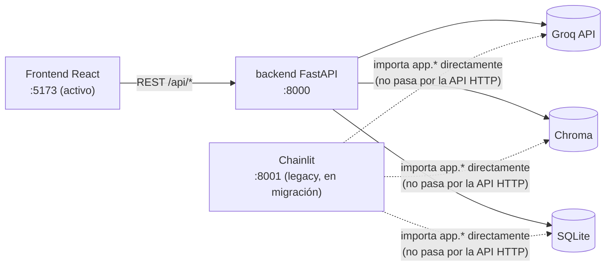

# Agentic-RAG Audit Workflow

Interfaz de chat conversacional (Chainlit) respaldada por un backend agéntico (FastAPI) que combina RAG (Chroma) sobre documentos de auditoría con herramientas de auditoría invocables por el LLM.

**Estado:** Build verificado, stack funcional en Docker. Ver [`docs/sdd-status.md`](docs/sdd-status.md) para el estado de implementación de cada spec y el plan de desarrollo.

---

## Stack

- **UI conversacional**: Chainlit (puerto 8001)
- **Frontend React**: Vite dev server (puerto 5173) — reemplaza gradualmente a Chainlit, corren ambos en paralelo hasta alcanzar paridad
- **Backend API**: FastAPI + Uvicorn (puerto 8000)
- **LLM (generación/tool-calling)**: Groq API — remoto, vía cliente OpenAI compatible. Ningún LLM generativo corre localmente.
- **Embeddings (RAG)**: modelo local `paraphrase-multilingual-MiniLM-L12-v2`, servido vía `fastembed` (ONNX Runtime). Ver detalle abajo.
- **Vector Store**: Chroma (persistencia a disco en volumen Docker)
- **Database**: SQLite (audit trail immutable, persistencia en volumen Docker)
- **Orquestación**: Tool-calling/function-calling sobre el LLM

### LLM remoto vs. modelo local de embeddings

Es una separación deliberada de responsabilidades, no una elección accidental:

| | Modelo | Dónde corre | Para qué |
|---|--------|-------------|----------|
| **Generación / tool-calling** | `llama-3.3-70b-versatile` (Groq) | Remoto, vía API (`GROQ_API_KEY`) | Todo el razonamiento del agente: decidir qué tool invocar, redactar respuestas. Ver `app/agentic_core/client.py`. |
| **Embeddings (RAG)** | `paraphrase-multilingual-MiniLM-L12-v2` | Local, `fastembed` (ONNX Runtime, sin pytorch) | Vectorizar chunks al ingerir y la query al buscar evidencia (`app/rag/vectorstore.py`). Nunca genera texto ni participa del tool-calling. |

El modelo de embeddings se eligió explícitamente por sobre el default de Chroma (`all-MiniLM-L6-v2`, optimizado para inglés) porque el corpus real (`docs/references/`) es normativa de auditoría en español, y el default no discriminaba bien relevancia en ese idioma. Se sirve vía `fastembed` (~220MB de descarga) en vez de `sentence-transformers` completo (arrastra pytorch/transformers, varios GB) para minimizar el tamaño de la imagen `Dockerfile.backend`.

No hay ningún LLM generativo descargado ni corriendo en el host/contenedores: toda generación de texto depende de que `GROQ_API_KEY` esté seteada y de conectividad saliente a `api.groq.com`.

---

## Arquitectura (resumen)



`chainlit` y `backend` son contenedores independientes que **no se hablan por HTTP**: `chainlit`
importa los mismos módulos Python del backend y comparte los volúmenes `chroma_data`/
`sqlite_data` directamente. `frontend` sí es un cliente HTTP real contra `backend` (con CORS).

Diagramas completos — secuencia del loop de tool-calling, pipeline de ingesta RAG y modelo de
datos — en [`docs/ARCHITECTURE.md`](docs/ARCHITECTURE.md).

---

## Estructura de Carpetas

```
.
├── app/                           # Backend FastAPI
│   ├── main.py                   # Punto de entrada (health endpoint `/api/health`)
│   ├── routers/                  # Endpoints por responsabilidad
│   ├── models/                   # SQLAlchemy ORM
│   ├── schemas/                  # Pydantic request/response schemas
│   ├── rag/                      # Pipeline de RAG (Chroma)
│   └── tools/                    # Audit tools para LLM
├── chainlit_ui/                  # UI conversacional
│   ├── chat.py                   # Punto de entrada (Chainlit loader inserta este directorio al inicio de sys.path; no llamar app.py para evitar colisión con paquete top-level)
│   ├── config.py                 # Sesión, auth
│   └── components/               # UI components
├── frontend/                     # Frontend React (Vite) — reemplaza gradualmente a chainlit_ui/
│   └── src/                      # Componentes, rutas, cliente HTTP contra el backend (src/lib/backend.ts)
├── docs/sample_evidence/         # Documentos de auditoría de ejemplo
├── tests/                        # Pytest tests
├── Dockerfile.backend            # Backend service image
├── Dockerfile.chainlit           # Chainlit UI service image
├── Dockerfile.frontend           # Frontend React service image (dev server)
├── docker-compose.yml            # Orquestación de servicios
├── pyproject.toml                # Declaración de dependencias
└── .env.example                  # Template de variables de entorno
```

---

## Decisiones de Arquitectura

### Volúmenes Docker Nombrados (Spec-009)

Para garantizar reproducibilidad y persistencia:

| Volumen | Ruta | Propósito |
|---------|------|----------|
| `chroma_data` | `/data/chroma` | Índice Chroma (RAG) |
| `sqlite_data` | `/data` | Base de datos SQLite (audit trail) |
| `chainlit_cache` | `/app/.chainlit` | Cache de sesiones |

**Guardrail:** Nunca eliminar volúmenes en scripts automatizados. Los datos persisten entre `docker compose up/down`.

### Servicios Separados

- **backend** (FastAPI): puerto 8000, responsabilidad API y persistencia
- **chainlit** (Chainlit): puerto 8001, responsabilidad UI conversacional
- **frontend** (React + Vite dev server): puerto 5173, UI en migración — reemplaza gradualmente a `chainlit`, que sigue corriendo en paralelo hasta alcanzar paridad. Bind-mount del código del host para hot reload; `/api` se proxea al `backend` (ver `vite.config.ts`).
- Network `audit-network` para comunicación entre servicios

### Variables de Entorno

Todas las variables sensibles se leen desde archivo `.env` (no versionado):
- `GROQ_API_KEY`: Token para LLM Groq (requerido)
- `BACKEND_API_URL`: URL de acceso al backend desde Chainlit
- `CHROMA_PERSIST_DIR`: Ruta de persistencia Chroma
- `AUDIT_DATABASE_URL`: Cadena de conexión SQLite (deliberadamente no `DATABASE_URL`: ese nombre
  colisiona con la convención de Chainlit para su propio data layer de persistencia respaldado
  por Postgres — con `DATABASE_URL` seteado, Chainlit intenta inicializarlo y crashea
  `/project/settings`, dejando la SPA en pantalla en blanco)

Ver `.env.example` para template completo. El archivo `.env.example` está versionado en git para referencia; los valores reales van solo en `.env` (en gitignore).

---

## Quickstart

### 1. Preparar ambiente

```bash
git clone <repo>
cd agentic-rag-audit-workflow
cp .env.example .env
# Editar .env y rellenar GROQ_API_KEY con valor real de https://console.groq.com
```

### 2. Build e inicio del stack

```bash
# Build de imágenes (primera vez o después de cambios en Dockerfile/dependencies)
docker compose build

# Iniciar servicios en background
docker compose up -d
```

### 3. Verificar salud de servicios

```bash
# Health check del backend
curl http://localhost:8000/api/health

# Ingesta de documentos de auditoría de ejemplo (docs/sample_evidence/)
curl -X POST http://localhost:8000/api/rag/ingest

# Acceder a UI Chainlit
# Navegador: http://localhost:8001

# Acceder al frontend React (en migración, paridad parcial con Chainlit)
# Navegador: http://localhost:5173
```

### 4. Ejecutar tests

Todos los tests se ejecutan dentro del contenedor (el host no tiene las dependencias Python instaladas):

```bash
# Tests de specs implementadas en este slice (46 passing, 1 skipped intencional)
docker compose run --rm backend python -m pytest -m "spec_001 or spec_002 or spec_004 or spec_005 or spec_008 or spec_010"
```

### 5. Detener stack

```bash
docker compose down
```

Los volúmenes persisten entre paradas. Para limpiar completamente (borra índice Chroma, audit trail, sesiones):
```bash
docker volume rm agentic-rag-audit-workflow_chroma_data agentic-rag-audit-workflow_sqlite_data agentic-rag-audit-workflow_chainlit_cache
```

**Advertencia:** La eliminación de volúmenes borra toda la historia de auditoría y el índice RAG. Solo hacer para reset total.

---

## Estado de SDD (Specs, Gaps, Plan de Desarrollo)

El estado de implementación de cada spec (`.ai/specs/`), los gaps de seguridad conocidos y el
plan de desarrollo por tasks/agente viven en [`docs/sdd-status.md`](docs/sdd-status.md) — separado
de este README porque cambian con cada slice, a diferencia de la arquitectura/despliegue de abajo.

---

## Guardrails Críticos

Restricciones que deben respetarse:
- Nunca eliminar volúmenes en scripts (evita perder índice RAG y audit trail)
- Nunca hardcodear secrets en docker-compose.yml (siempre via .env)
- Nunca ejecutar instalación de paquetes en host (usar docker compose exec en contenedor)
- Nunca DELETE/UPDATE directo en tablas de auditoría (usar soft-supersede con campo superseded_by)

---

## Referencias

- Arquitectura: [`docs/ARCHITECTURE.md`](docs/ARCHITECTURE.md)
- Specs: `.ai/specs/rag/`, `.ai/specs/audit/`, `.ai/specs/platform/`
- Skills: `.ai/skills/docker-deployment/`, `.ai/skills/vectorstore-chroma-faiss/`
- Guardrails: `.ai/guardrails/restricted-ops.json`

---

**Versión:** 0.1.0-e2e-slice-1
