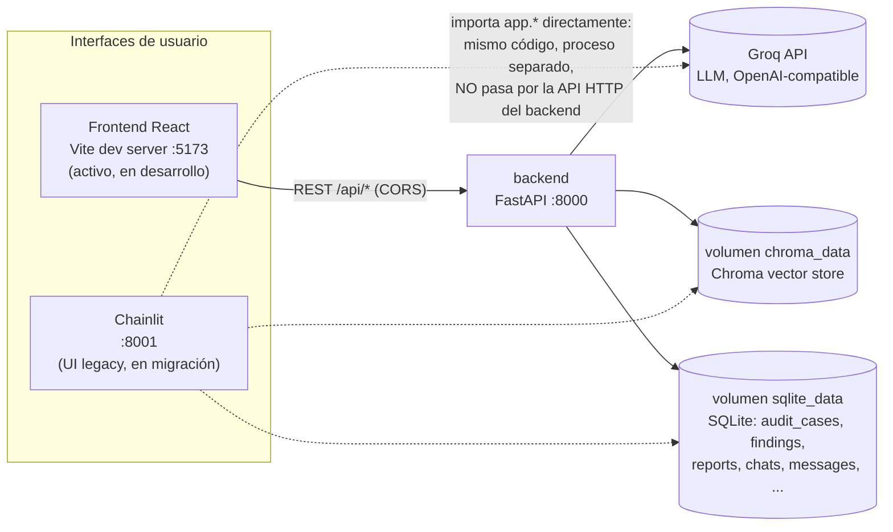
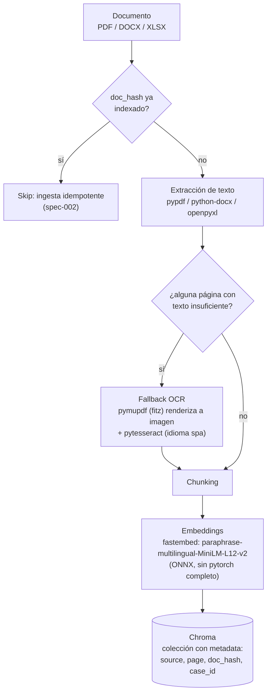
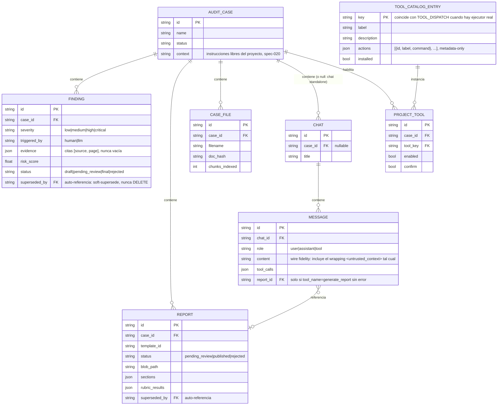

# Arquitectura

Este documento complementa el [README.md](../README.md) con el detalle de cómo está
construido el producto: qué servicios existen, cómo fluye un turno del agente, cómo se
ingesta un documento al RAG y cómo se modelan los datos de auditoría.

---

## 1. Contenedores y servicios



**Puntos no obvios:**

- `chainlit` y `backend` son contenedores independientes que **no se hablan por HTTP entre
  sí**. El servicio `chainlit` importa los mismos módulos Python (`app.agentic_core`,
  `app.routers`, modelos ORM) e interactúa directamente con la sesión de SQLAlchemy — ambos
  procesos simplemente comparten los volúmenes `chroma_data` y `sqlite_data`. Ver el docstring
  de [`chainlit_ui/chat.py`](../chainlit_ui/chat.py) (punto 6) para el razonamiento completo.
- El servicio `frontend` sí es un cliente HTTP real: llama a `backend` vía `fetch`/React
  Query contra `/api/*`, por eso `app/main.py` agrega `CORSMiddleware`.
- **Migración en curso**: `frontend` reemplaza gradualmente a `chainlit` (ver comentario en
  [`docker-compose.yml`](../docker-compose.yml)). Ambos servicios corren en paralelo hasta que
  el frontend alcance paridad de funcionalidad; no hay fecha fija de apagado de `chainlit`.

---

## 2. Turno del agente (tool-calling loop)

`app/agentic_core/loop.py::run_agent_turn` es el único punto de entrada al agente, sin
importar si lo invoca `chainlit_ui/chat.py` o `app/routers/chats.py` (frontend).

```mermaid
sequenceDiagram
    actor Usuario as Usuario auditor
    participant UI as Frontend / Chainlit
    participant Loop as agentic_core.run_agent_turn
    participant LLM as Groq (LLM)
    participant Tools as TOOL_DISPATCH
    participant RAG as Chroma
    participant DB as SQLite (audit trail)

    Usuario->>UI: mensaje de chat
    UI->>Loop: run_agent_turn(mensaje, historial, case_id)
    loop hasta MAX_TOOL_ITERATIONS=6 o respuesta final
        Loop->>LLM: chat.completions.create(system fijo + historial, tools=AGENT_TOOL_SPECS)
        LLM-->>Loop: texto final, o tool_calls
        alt hay tool_calls
            Loop->>Tools: ejecuta search_evidence / create_finding / generate_report
            Tools->>RAG: similarity_search (search_evidence)
            Tools->>DB: INSERT append-only (create_finding / generate_report)
            Tools-->>Loop: resultado estructurado (nunca excepción cruda, spec-003)
            Note over Loop: chunks recuperados se envuelven en\n"&lt;untrusted_context&gt;" antes de\nvolver a entrar al historial (spec-005)
        else sin tool_calls
            Loop-->>UI: final_text + tool_calls[] + historial actualizado
        end
    end
    UI-->>Usuario: respuesta + un Step/card por tool call ejecutado
    opt finding high/critical, o cualquier report generado
        UI->>Usuario: acción aprobar/rechazar (human-in-the-loop, spec-006)
    end
```

Reglas de diseño no negociables de este loop (ver `.ai/skills/agentic-tool-use/SKILL.md` y
`.ai/skills/security-prompt-injection/SKILL.md`):

1. El `SYSTEM_PROMPT` es fijo — nunca se interpola contenido de documentos ni la
   documentación de las tools ahí dentro; las tools solo se declaran vía el parámetro
   `tools=` de la API.
2. El único disparador legítimo de un turno es el `user_message` humano. Los `tool_calls`
   que el LLM emite durante ese turno se ejecutan porque el modelo los emitió en respuesta a
   ESE turno, nunca porque el loop reinterprete contenido de un `<untrusted_context>` como
   una instrucción nueva.
3. Cada chunk recuperado por `search_evidence` se envuelve en
   `<untrusted_context source="..." page="...">...</untrusted_context>` con un aviso de
   seguridad explícito, y cualquier intento de "escape" del delimitador dentro del propio
   texto del chunk se neutraliza (`_neutralize_delimiter_breakout`).
4. `MAX_TOOL_ITERATIONS = 6` es un límite bajo y explícito: si se agota sin una respuesta
   final, el turno se corta con un aviso (`hit_max_iterations=True`) en vez de loopear
   indefinidamente.

**Gaps de seguridad conocidos** (documentados en código, no bugs escondidos): no hay
allowlist estructural de qué tools puede invocar el LLM según el contexto del turno, y no hay
redacción/filtrado de PII sobre el texto de los chunks antes de reexponerlo al LLM. Ver
sección de gaps en el [README](../README.md#gaps-de-seguridad-conocidos-y-próximos-pasos).

---

## 3. Pipeline de ingesta RAG



Decisiones relevantes (ver `app/rag/vectorstore.py`, `app/rag/extractors.py`):

- El modelo de embeddings **no** es el default de Chroma (`all-MiniLM-L6-v2`, optimizado
  para inglés): se reemplazó por `paraphrase-multilingual-MiniLM-L12-v2` porque el corpus
  real (`docs/references/`, normativa de auditoría en español) devolvía similitudes genéricas
  (~0.65–0.74) sin discriminar relevancia real con el modelo default.
- El fallback OCR existe para páginas de PDF donde `pypdf` extrae muy poco texto (copias con
  marca de agua/DRM que renderizan el contenido como imagen).
- `case_id` en la metadata (spec-020) permite que `search_evidence` recupere evidencia propia
  de un proyecto además de la normativa general — es un aislamiento *best-effort*, no
  estricto (ver `app/rag/retrieval.py`).
- Retrieval aplica un umbral configurable de similitud (spec-008): por debajo del umbral, la
  tool devuelve `insufficient_evidence=true` en vez de forzar una respuesta con evidencia
  débil.

---

## 4. Modelo de datos



Notas de diseño:

- `Finding` y `Report` son **append-only** (spec-004 / spec-011): nunca hay `DELETE` ni
  `UPDATE` destructivo, solo `superseded_by` apuntando al registro que reemplaza al actual.
- `Message` guarda **dos representaciones** del mismo turno a propósito: la fidelidad de
  wire (`content`, `tool_calls`, `tool_call_id`) que espera `run_agent_turn` para reconstruir
  el historial, y una versión estructurada (`tool_name`/`tool_input`/`tool_output`) para que
  el frontend renderice un tool-step sin re-parsear el `content` envuelto.
- `ToolCatalogEntry.key` no garantiza un ejecutor real: `TOOL_DISPATCH` en
  `app/agentic_core/tools_registry.py` es la única fuente de verdad de qué tools tienen
  código Python detrás. Agregar una entry desde la UI es, a propósito, solo metadata —
  ejecutar comandos arbitrarios desde ahí sería una superficie de RCE que requiere su propio
  diseño de sandboxing.

---

## Referencias

- Specs SDD: [`.ai/specs/`](../.ai/specs/)
- Skills (Quick Rules) por dominio: [`.ai/skills/`](../.ai/skills/)
- Guardrails: [`.ai/guardrails/restricted-ops.json`](../.ai/guardrails/restricted-ops.json)
