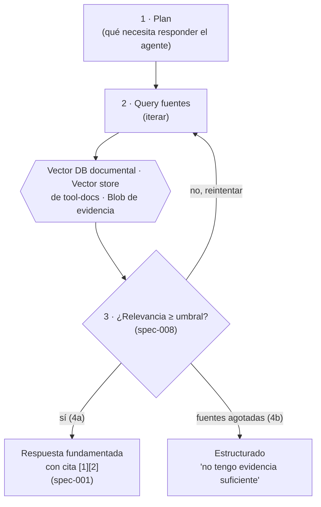
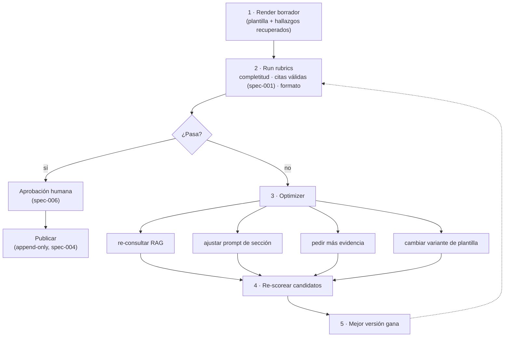
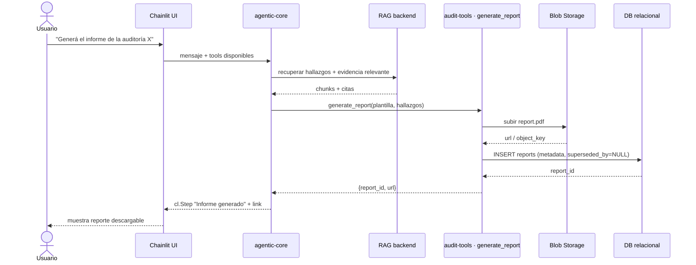

# Plan: contexto de tools, RAG, almacenamiento de reportes e informes desde plantilla

**Estado del repo al momento de este plan**: solo existen specs (`.ai/specs/`) y stubs de test
(`tests/specs/`); no hay backend FastAPI, pipeline RAG ni loop agéntico implementados — únicamente
`chainlit/demo.py`. Este plan traduce los dos diagramas de referencia ("AI Agents + Harness + Evals"
y "Agentic RAG Workflow") al dominio concreto de auditoría de este proyecto.

## 0. Alcance

1. Exponer herramientas + su documentación como contexto para tool calls (agentic-core).
2. RAG sobre documentos de auditoría vía backend FastAPI (rag-engineer + backend-api).
3. Almacenamiento de reportes generados por herramientas (audit-tools + backend-api).
4. Generación de informes analíticos desde plantillas suministradas por el usuario (audit-tools).

## 1. Arquitectura general

Adaptación de "Agentic RAG Workflow": las fuentes propias de este proyecto (evidencia de auditoría,
normativa, documentación de tools, plantillas de informe) alimentan la misma capa de conocimiento,
y las tools de auditoría quedan entre esa capa y el agente — nunca dentro del system prompt
(regla 4 de `.ai/skills/agentic-tool-use/SKILL.md`).

```mermaid
flowchart LR
    subgraph FUENTES["Fuentes"]
        DOC["Evidencia de auditoría<br/>(PDF/DOCX/XLSX)"]
        NORM["Normativa / políticas"]
        TOOLDOC["Documentación de tools"]
        TPL["Plantillas de informe"]
    end

    subgraph CHUNK["Chunking"]
        REC["Recursive"]
        PAR["Paragraph"]
        SEM["Semantic"]
    end

    EMB["Embedding model"]

    subgraph KNOW["Capa de conocimiento"]
        VDB[("Vector DB<br/>Chroma / FAISS")]
        RDB[("DB relacional<br/>audit_trail · findings · reports")]
        BLOB[("Blob storage<br/>evidencia · reportes")]
    end

    subgraph TOOLS["Tools (audit-tools)"]
        T1["create_finding"]
        T2["search_evidence"]
        T3["generate_report"]
        T4["..."]
    end

    subgraph AGENTE["agentic-core"]
        LOOP["Loop de tool-calling"]
    end

    UI["Chainlit UI"]
    USER(["Usuario auditor"])

    FUENTES --> CHUNK --> EMB --> KNOW
    KNOW <--> TOOLS
    TOOLS <--> AGENTE
    AGENTE <--> UI
    USER -- "Mensaje" --> UI
    UI -- "Respuesta + Steps" --> USER
```

## 2. Selección de tools + grounding RAG

Adaptación de "Retrieval as a Subagent": el mismo patrón itera-evalúa-responde se usa tanto para
recuperar evidencia documental como para decidir qué subconjunto de tools (con su documentación)
exponer en el turno, evitando saturar el contexto cuando el catálogo de `audit-tools` crezca.

## 3. Generación de informes desde plantilla

Adaptación del "Eval and Optimizer Loop": el informe se renderiza sobre la plantilla suministrada
(no se regenera el documento entero), se valida contra rubricas objetivas, y solo si pasa se
somete a aprobación humana antes de publicarse — integrando `spec-006-human-in-the-loop`.

## 4. Almacenamiento de reportes generados

Secuencia concreta de dónde vive cada artefacto, siguiendo el mismo patrón inmutable que ya rige
`audit_trail` (`spec-004`): el archivo va a blob storage, la fila en la DB relacional es append-only.

## 5. Plan de tareas por agente

| # | Tarea | Agente | Entregable | Spec relacionada |
|---|-------|--------|------------|-------------------|
| 1 | Indexar documentación de tools como vector store separado | `rag-engineer` | pipeline de ingesta de tool-docs | *(nueva, ver §6)* |
| 2 | Loop de selección dinámica de tools por turno | `agentic-core` | lógica de filtrado antes del tool-calling | `.ai/skills/agentic-tool-use` |
| 3 | Endpoint RAG sobre evidencia de auditoría | `backend-api` + `rag-engineer` | `/rag/query` | `spec-001`, `spec-008` |
| 4 | Tool `generate_report` con render de plantilla | `audit-tools` | tool invocable + rubric checker | *(nueva, ver §6)* |
| 5 | Persistencia de reportes (blob + fila DB append-only) | `backend-api` | modelo `Report`, endpoint de descarga | `spec-004` (patrón extendido) |
| 6 | Paso de aprobación humana antes de publicar informe | `chainlit-ui` + `agentic-core` | `cl.Action` aprobar/rechazar | `spec-006` |
| 7 | Defensa de prompt injection en plantillas y tool-docs ingeridos | `security-compliance` | revisión de sanitización | `spec-005` |
| 8 | Tests de contrato para los puntos 1-6 | `testing` | `tests/specs/test_spec_0NN_*.py` | — |

## 6. Nuevas specs SDD a crear

Ningún spec actual cubre reportes ni tool-doc retrieval. Antes de implementar, `planner` debería
generar (usando `.ai/specs/SPEC_TEMPLATE.md`):

- **spec-011 — Inmutabilidad de reportes generados**: mismo contrato append-only de `spec-004`
  aplicado a la tabla `reports` y al blob subyacente.
- **spec-012 — Contrato de generación de informes desde plantilla**: qué placeholders puede
  completar el LLM, qué rubricas son obligatorias antes de publicar, y el gate de `spec-006`.
- **spec-013 — Exposición dinámica de tools vía retrieval**: umbral de relevancia para incluir una
  tool en el turno, y qué pasa si ninguna tool indexada supera el umbral.

## 7. Riesgos y guardrails a respetar

- Documentación de tools = declaración de la tool (parámetro `tools` de la API), nunca texto
  reescrito en el system prompt (regla 4, `agentic-tool-use`).
- Ningún `DELETE` físico sobre `reports`/`audit_findings`/`audit_trail` — bloqueado por
  `.ai/guardrails/restricted-ops.json` y verificado por `reviewer`.
- Umbral de relevancia de retrieval (`spec-008`) aplica igual a evidencia documental y a tool-docs.
- Informes publicados sin paso de aprobación humana violan `spec-006` — el "Publicar" del §3 no es
  opcional saltarlo.
