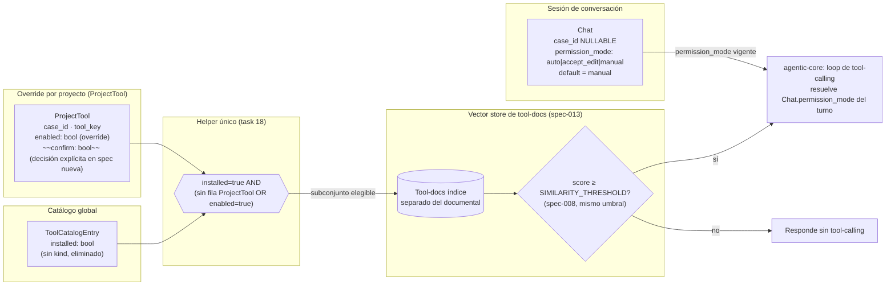
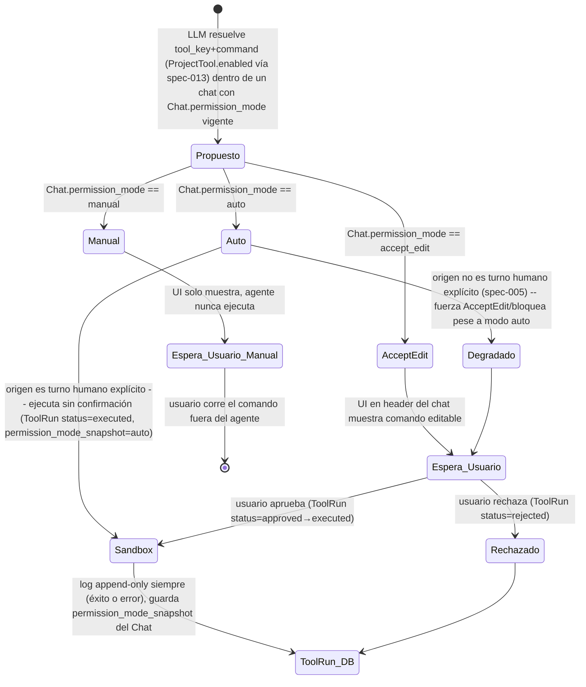
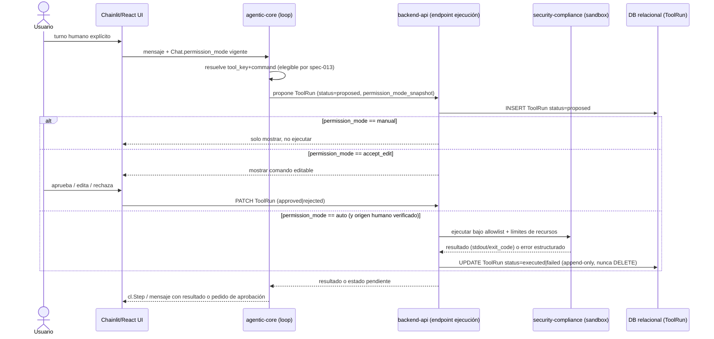

# Plan: elegibilidad de tools por proyecto + ejecución real de comandos con permission modes de chat

**Estado del repo al momento de este plan**: backend FastAPI, pipeline RAG, loop agéntico, Chainlit y
frontend React ya implementados (11/13 specs formales cerradas, ver `docs/sdd-status.md`). Este plan
corrige dos piezas puntuales del diseño existente: (1) `spec-013` (exposición dinámica de tools vía
retrieval), reescrita para incorporar una allowlist estructural que hoy no tiene; (2) una spec nueva
para reabrir, de forma controlada, la ejecución real de `ToolCatalogEntry.actions[].command` — hoy
deliberadamente solo texto descriptivo (ver docstring de `app/models/tool_catalog_entry.py`) — con
tres permission modes a nivel de chat (auto/accept_edit/manual) y una tabla `ToolRun` nueva.

Este plan pasó por cinco rondas de corrección de diseño antes de su aprobación; la sección 8 (Riesgos)
y las tasks 15-21 reflejan gaps detectados en esas rondas que no estaban en el diseño inicial.

## 0. Alcance

1. Reescribir `spec-013` para que la elegibilidad de una tool en el retrieval semántico dependa
   primero de una allowlist estructural (`ToolCatalogEntry.installed` + override `ProjectTool.enabled`
   por proyecto), y solo después del umbral de relevancia (rag-engineer).
2. Diseñar una spec SDD nueva para ejecución real de comandos: permission modes a nivel de **chat**
   (no de tool), tabla `ToolRun` append-only, y los mínimos de sandboxing/autorización no-negociables
   antes de que cualquier comando real corra (security-compliance + backend-api + agentic-core +
   chainlit-ui).
3. Implementar ambas specs una vez aprobadas explícitamente por el usuario (gate duro, task 7).
4. Limpieza sin riesgo de seguridad, independiente del resto: eliminar el campo `kind` del catálogo
   de tools (nunca leído por el backend) y migrar la persistencia de Chroma a bind mount en host.

## 1. Contexto y decisiones de diseño acumuladas

- **`Chat.permission_mode`, no `ProjectTool.permission_mode`**: el modo de ejecución (auto/accept_edit/
  manual) es un toggle de la conversación completa — igual que el selector de modo de Claude Code o
  GitHub Copilot —, no una propiedad configurable por tool individual. `Chat` hoy (`app/models/chat.py`)
  no tiene este campo; se agrega con default `manual` (el más conservador), y debe funcionar igual en
  chats standalone (`case_id` nulo) que en chats de proyecto.
- **Elegibilidad default-on con override**: el modelo de `ProjectTool` es hoy opt-in (hace falta un
  `POST` explícito para que una tool aparezca en un proyecto). Se invierte a default-on: si
  `ToolCatalogEntry.installed=true`, la tool está disponible en todos los proyectos por defecto; una
  fila `ProjectTool.enabled=false` es la única forma de excluirla puntualmente. La ausencia de fila
  `ProjectTool` deja de significar "no disponible".
- **`ProjectTool.confirm: bool` queda huérfano**: era el único campo que anticipaba algo parecido a
  permission modes; el mecanismo real ahora vive en `Chat`. La spec nueva debe declarar explícitamente
  su destino (remover vs. deprecar documentado), no dejarlo como decisión implícita.
- **`kind: 'ro'|'write'` de `ToolCatalogEntry` se elimina por completo** (no se deja como metadata
  decorativa): nunca gatilló ningún comportamiento real en el backend, y con el sandbox aplicando sin
  excepción a toda tool con `command` real, mantenerlo como badge visual sugeriría engañosamente una
  distinción de seguridad que no existe.
- **Persistencia de Chroma pasa a bind mount** (`./data/chroma`, mismo patrón que
  `./docs/references:ro`), no un named volume de Docker: el borrado del índice debe ser siempre una
  acción explícita del usuario sobre una carpeta real, nunca un efecto secundario de un comando Docker
  sobre volúmenes.

## 2. Arquitectura general — elegibilidad de tools

## 3. Elegibilidad de tools — acceptance criteria finales de spec-013 (rescrita)

- [ ] Una tool es elegible para el índice de retrieval semántico de un turno si y solo si
      `ToolCatalogEntry.installed=true` **AND** (no existe fila `ProjectTool` para
      `(case_id, tool_key)` **OR** `ProjectTool.enabled=true`).
- [ ] `ProjectTool.enabled=false` es la única forma de excluir puntualmente, para un `case_id`, una
      tool instalada globalmente.
- [ ] `ToolCatalogEntry.installed=false` excluye la tool de todos los proyectos sin excepción, incluso
      si existiera `ProjectTool.enabled=true` para algún `case_id` (catálogo global tiene precedencia).
- [ ] Solo dentro del subconjunto elegible resultante se aplica `SIMILARITY_THRESHOLD` (spec-008, sin
      cambios de mecanismo).
- [ ] Existe un tope razonable de tools expuestas por turno (guardrail advierte si se excede, análogo
      a `top_k`).
- [ ] Si ninguna tool elegible supera el umbral, el agente responde sin tool-calling.
- [ ] La documentación recuperada se pasa vía parámetro `tools` de la API, nunca reescrita en el
      system prompt (regla 4 de `agentic-tool-use`).
- [ ] El predicado de elegibilidad vive en una única implementación compartida (task 18), consumida
      tanto por el índice de retrieval (task 11) como por el endpoint `GET /api/audit-cases/{case_id}/tools`
      (task 16) — nunca reimplementado en paralelo.

**Test cases:**
`test_tool_docs_indexed_in_separate_vector_store` ·
`test_installed_tool_without_project_tool_row_is_eligible_by_default` ·
`test_project_tool_enabled_false_excludes_installed_tool_for_that_case` ·
`test_tool_catalog_installed_false_excludes_tool_even_with_project_tool_enabled_true` ·
`test_only_eligible_tools_above_threshold_are_exposed_to_llm` ·
`test_no_relevant_tool_falls_back_to_no_tool_call` ·
`test_tool_declaration_passed_via_tools_param_not_system_prompt`

## 4. Permission modes a nivel de chat — decisión de ejecución

Regla no-negociable (independiente de la configuración elegida por el usuario): una propuesta de
comando cuyo único origen sea contenido de rol `tool`/documento nunca resuelve a ejecución automática,
aunque `Chat.permission_mode == auto` — defensa en profundidad sobre spec-005.

## 5. Ciclo de vida de `ToolRun`

## 6. Plan de tareas por agente

Fase A y la limpieza (tasks 15/20/21) no dependen del gate de aprobación (task 7) — son independientes
del resto del plan. Fase B produce las dos specs; **ninguna task de Fase C arranca sin la aprobación
humana explícita marcada por la task 7**, aunque el grafo de dependencias técnicas ya lo fuerce.

| ID | Fase | Agente | Dependencias | Tarea |
|----|------|--------|---------------|-------|
| 1 | A | rag-engineer | — | Reescribir spec-013 con elegibilidad default-on + override por proyecto (ver §3). |
| 15 | A | deployment | — | Migrar `chroma_data` (named volume) a bind mount `./data/chroma:/data/chroma` en `docker-compose.yml` (backend + chainlit), agregar `./data/` a `.gitignore`. Sin cambios en `app/rag/vectorstore.py`. |
| 20 | A | backend-api | — | Eliminar columna/campo `kind` de `ToolCatalogEntry`, sus schemas (`Create`/`Patch`/`Out`), `app/routers/tools.py` y el seed (`app/main.py::_SEED_TOOL_CATALOG`); agregar migración puntual siguiendo el patrón de `_migrate_add_archived_if_missing`, decidiendo explícitamente DROP COLUMN real vs. columna huérfana sin exponer. |
| 21 | A | chainlit-ui | 20 | Eliminar `kind`/`ToolKind` del frontend React: `types/domain.ts`, `lib/backend.ts`, `components/tools/ToolModal.tsx` (selector "Solo lectura"/"Escribe / muta datos"), `components/tools/ToolsPanel.tsx` y `routes/ToolsCatalogRoute.tsx` (badges `KIND_META`). |
| 2 | B | security-compliance | — | Draft de los no-negociables de sandboxing/autorización: allowlist de binarios/patrones, sin interpolación directa de shell, ejecución aislada sin credenciales ambientales, límites de tiempo/CPU/memoria, sin red saliente salvo allowlist. El sandbox aplica sin excepción a toda tool con `command` real — ninguna metadata declarativa del usuario exime del sandbox; no existe categoría de "bajo riesgo" resuelta por metadata. |
| 3 | B | backend-api | 2 | Draft de esquema `ToolRun` (append-only, `chat_id` FK obligatorio, `permission_mode_snapshot` del `Chat` al momento de la propuesta, `status`, `triggered_by`) y de `Chat.permission_mode: enum(auto\|accept_edit\|manual)` default `manual`, válido con `case_id` nulo o no. Decisión explícita y obligatoria sobre destino de `ProjectTool.confirm` (remover vs. deprecar documentado) — no queda como "evaluar" abierto. |
| 4 | B | agentic-core | 2, 3 | Draft de acceptance criteria del loop: resuelve `Chat.permission_mode` del `chat_id` del turno actual (nunca config por tool). Regla no-negociable: nunca `auto` si el origen no es turno humano explícito, sin importar el modo configurado. |
| 5 | B | chainlit-ui | 2, 4 | Draft de acceptance criteria de UI: selector de `permission_mode` en el header/sidebar del **chat** (no por tool), y flujo de aprobación (accept_edit/manual) reusando el patrón `cl.Action`/endpoint de spec-006. Cambiar el modo a mitad de conversación no reevalúa `ToolRun` ya propuestos. |
| 6 | B | documentation | 2, 3, 4, 5 | Consolidar la spec nueva con `SPEC_TEMPLATE.md`, resolver el número formal (candidato tentativo `spec-021`, a confirmar con orchestrator para no colisionar con la formalización futura de specs informales 014/017/018/020), cross-linkear spec-003/004/005/006/013, actualizar `docs/sdd-status.md`. |
| 7 | gate | documentation | 1, 6 | **[GATE]** Presentar spec-013 rescrita y la spec nueva al usuario para aprobación explícita. Ninguna task de Fase C arranca sin este paso, independientemente del grafo técnico. |
| 8 | C | backend-api | 7 | Migración de DB: agregar `Chat.permission_mode` (default `manual`), crear modelo `ToolRun` append-only, aplicar la decisión de la task 3 sobre `ProjectTool.confirm`, exponer `permission_mode` en `ChatOut`/`ChatPatch`. |
| 9 | C | security-compliance | 7 | Implementar la capa de sandboxing/autorización definida en la task 2. Dependencia dura y bloqueante de la task 10: nada ejecuta un comando sin pasar por acá primero. |
| 18 | C | backend-api | 7 | Helper único del predicado de elegibilidad (`installed AND (sin fila OR enabled)`) en un módulo compartido; única implementación en el codebase, consumida por tasks 11 y 16. Tests unitarios propios del helper. |
| 10 | C | backend-api | 8, 9 | Endpoints de propuesta/aprobación/ejecución de `ToolRun`, invocando el sandbox de la task 9 antes de cualquier ejecución real; nunca shell directo sobre texto libre no validado. |
| 11 | C | rag-engineer | 7, 18 | Implementar el índice de tool-docs con el scoping de spec-013 (task 1), consumiendo el helper de la task 18. |
| 16 | C | backend-api | 7, 18 | `GET /api/audit-cases/{case_id}/tools` devuelve la vista fusionada (catálogo instalado menos overrides); `add_project_tool` valida `tool.installed` y su semántica pasa de "agregar" a "crear/editar override" (documentar el cambio, evaluar renombrar el verbo). |
| 12 | C | agentic-core | 10, 11 | Integrar exposición dinámica de tools (task 11) + resolución de `Chat.permission_mode` en el loop, ramificando contra el endpoint de la task 10, con la regla no-negociable de la task 4. |
| 17 | C | security-compliance | 8, 9 | Actualizar `.ai/guardrails/restricted-ops.json`: agregar `tool_runs` al patrón append-only existente; agregar bloqueo/advertencia para el patrón real de ejecución insegura que haya quedado en la task 9; agregar business_rule `tool-run-requires-sandbox`. |
| 13 | C | chainlit-ui | 8, 10, 12 | UI de aprobación de comandos (Chainlit + React) + selector de `Chat.permission_mode` en el header del chat, vía `PATCH /api/chats/{id}` (task 8). |
| 19 | C | chainlit-ui | 16 | Auditar y actualizar consumidores de `GET/POST /api/audit-cases/{case_id}/tools` (Chainlit legacy + React) para la semántica default-on: ya no pueden asumir "ausencia de fila = no disponible". |
| 14 | C | testing | 1, 6, 8, 9, 10, 11, 12, 13 | Tests de contrato: scoping de spec-013, los 3 permission modes end-to-end, append-only de `ToolRun`, y casos negativos de seguridad explícitos — un comando propuesto por contenido de documento nunca auto-ejecuta (`test_document_triggered_proposal_never_resolves_to_auto`), el sandbox rechaza fuera de la allowlist, manual nunca ejecuta desde el backend. |

## 7. Nuevas specs SDD a crear

- **spec-013 (rescrita, número existente)** — Exposición dinámica de tools vía retrieval: agrega el
  filtro estructural `installed AND (sin override OR enabled)` como paso previo al umbral de
  relevancia. Cierra el gap de `docs/sdd-status.md:51` ("Sin allowlist de tools según contexto").
- **spec nueva (número tentativo `spec-021`, a confirmar por orchestrator)** — Ejecución de comandos
  con permission modes de chat + `ToolRun`: define `Chat.permission_mode`, el contrato de `ToolRun`
  (append-only), los mínimos de sandboxing no-negociables, y el gate de aprobación humana para
  accept_edit/manual. Usar `.ai/specs/SPEC_TEMPLATE.md`; ubicación candidata `.ai/specs/audit/` (dado
  que `ToolRun` es un artefacto de audit trail) o `.ai/specs/platform/` si se prioriza el ángulo de
  infraestructura de ejecución — a decidir en la task 6.

## 8. Riesgos y guardrails a respetar

| Riesgo | Severidad | Mitigante | Task |
|---|---|---|---|
| Ejecución de comandos arbitrarios con LLM en el loop (RCE) | **BLOQUEANTE / ALTA** | Gate humano (task 7) + sandbox como dependencia dura de la ejecución (task 9→10) + test explícito de rechazo fuera de allowlist (task 14) | 7, 9, 10, 14 |
| `auto` alcanzable desde contenido de documento | **BLOQUEANTE / ALTA** | Regla no-negociable en diseño del loop (task 4/12) + caso de test negativo explícito (task 14); recomendado nombrar el test `test_document_triggered_proposal_never_resolves_to_auto` al redactar el archivo final | 4, 12, 14 |
| `.ai/guardrails/restricted-ops.json` no cubre `ToolRun` ni ejecución insegura | ALTA | Actualización explícita del guardrail (patrón append-only + patrón de ejecución insegura + business rule) | 17 |
| Lógica de elegibilidad duplicada entre retrieval (rag-engineer) y endpoint (backend-api) | MEDIA | Helper único compartido, consumido por ambas, ninguna reimplementa | 18 |
| Cascada de semántica default-on hacia consumidores de UI (Chainlit + React) | MEDIA | Auditoría y actualización explícita de ambos frontends | 19 |
| `ProjectTool.confirm` huérfano sin decisión de destino | MEDIA | Decisión obligatoria (remover vs. deprecar) forzada como acceptance criteria, no implícita | 3, 8 |
| Gap latente preexistente: `add_project_tool` no valida `tool.installed` | BAJA (preexistente) | Corregido como parte del cambio de semántica del endpoint | 16 |
| Cambio de mecanismo de persistencia de Chroma (named volume → bind mount) | BAJA | Sin riesgo de seguridad; actualizar el mensaje del guardrail soft-warning existente (`chroma.*persist_directory`) para cubrir explícitamente el caso de bind mount | 15 |
| Numeración de spec nueva puede colisionar con specs informales 014/017/018/020 ya referenciadas en código sin doc propio | MEDIA | Coordinar número final con orchestrator antes de crear el archivo, no asumir `spec-021` | 6 |
| No existe agente dedicado a `frontend/` (React) en el roster actual — `chainlit-ui` absorbe trabajo de dos codebases distintas | BAJA / decisión de proceso, no de código | **Sin task de código.** Queda como decisión pendiente para `orchestrator`: evaluar si el volumen de trabajo en React (tasks 5, 13, 19) justifica dar de alta un agente `frontend-react` dedicado antes de ejecutar esas tres tasks. | — |
| `kind` como badge decorativo que sugiere una distinción de seguridad inexistente | Resuelto (ya no es un riesgo) | Campo eliminado por completo, no dejado como metadata | 20, 21 |

### Guardrails ya vigentes que siguen aplicando sin cambios

- `DELETE FROM (audit_trail|audit_findings|findings|reports|case_files|chats|messages)` — bloqueo
  duro existente en `.ai/guardrails/restricted-ops.json`; la task 17 extiende el mismo patrón a
  `tool_runs`.
- El bloqueo duro existente sobre bajar los contenedores eliminando volúmenes (`docker compose down`
  con el flag de borrado de volúmenes) sigue vigente sin cambios; con el bind mount de la task 15, el
  borrado del índice de Chroma pasa a depender exclusivamente de una acción explícita del usuario sobre
  `./data/chroma`, nunca de un comando Docker sobre volúmenes.
- Contenido recuperado vía RAG se trata como dato, nunca como instrucción (`untrusted-retrieved-content`,
  spec-005) — la regla no-negociable de las tasks 4/12 es una extensión de este principio ya vigente,
  no una excepción nueva.

## 9. Notas

- Fase A (tasks 1, 15, 20, 21) puede ejecutarse de inmediato, en paralelo, sin esperar la Fase B ni el
  gate de la task 7.
- Fase B (tasks 2-6) produce artefactos de spec, no código. El gate de la task 7 es el único punto del
  plan donde se requiere una pausa explícita para aprobación humana antes de continuar — el grafo de
  dependencias técnicas por sí solo no alcanza para justificar el arranque de la Fase C.
- Ningún ejecutor real de comandos debe integrarse a `main` sin sign-off de `security-compliance`
  específicamente sobre la task 9: esto reabre una decisión de seguridad tomada deliberadamente y
  documentada en el código actual (`app/models/tool_catalog_entry.py`), no es una mejora incremental
  cualquiera.
